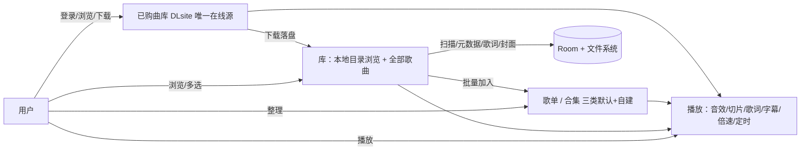

# 需求分析：Eara Player（EaraAsmrPlayer 二次开发）

* 版本：v1.1（已冻结）

* 确认状态：已确认（2026-10-08 客户批准，需求基线冻结；后续变更走修订记录）

* 基线分支：`redevelop`（= `refactor/architecture-cleanup` @ 5a0cbff，重构后架构）

* 访轮次：5 轮（2026-10-08），需求边界由客户逐项拍板

## 1. 背景与目标

基于 EaraAsmrPlayer（ASMR 音声播放器）二次开发，将产品定位从「ASMR 音声专用」转向「通用音频播放器」：删除全部联网热点功能（搜索、热门收听、收藏、一起听）与 asmr.one 内容源全链路，保留 DLsite 连接（登录/已购曲库/下载/元数据云同步）作为唯一在线内容通道，保留完整本地播放能力，新增本地音乐库模块（元数据扫描/歌词/封面/全部歌曲视图）。成功标准：删除后全量测试全绿、无残留死入口；本地音乐能力覆盖主流格式万级曲库；日常使用无「ASMR」字样强绑定。

## 2. 开发时序原则（兜底策略）

**先跑通新逻辑，再删除旧代码**——绞杀者模式，全程仓库任何时点可构建、可安装、可日常使用：

1. **阶段一（并行搭建）**：新增类故事（US-01~06）在旧代码共存下实现——本地音乐扫描/元数据/歌词、五页签新导航骨架、歌单/合集映射与批量添加。新逻辑以独立模块/路由落地，不与待删代码纠缠；每步全量测试全绿。
2. **阶段二（入口切换）**：导航与首页切到新信息架构（五页签），DLsite 已购页从搜索页签独立；实机走查新链路端到端可用。此阶段结束时旧功能入口已不可达，但旧代码仍在。
3. **阶段三（删除清理）**：执行删除类故事（DEL-01~07）——按依赖族从叶子往上删（UI 入口 → VM/编排 → repository → api/crawler → 设置项 → 死表），每删一族跑全量测试 + ci_guard，ratchet 数字只降不升。
4. **兜底规则**：任何阶段发现新逻辑无法覆盖旧功能时，允许回退到共存状态修新逻辑，禁止「先删后建」造成功能真空；删除类故事的验收在阶段三统一执行。

## 3. 用户故事

### 删除类（验收标准 = 功能不可达 + 代码/入口清理干净；实施时序见上节，统一在阶段三执行）

| 编号     | 内容             | 验收标准                                                                                                                        | 优先级 |
| ------ | -------------- | --------------------------------------------------------------------------------------------------------------------------- | --- |
| DEL-01 | 搜索功能整体删除       | 搜索页/路由/热搜轮播/搜索屏蔽词设置全部移除；SearchQueryStrategy 四分支清空后编排层移除；全仓无 search 路由残留                                                     | P0  |
| DEL-02 | 热门收听删除         | hotlistening 包、底部导航页签、Eara 后端上报（播放次数/时长）全部移除                                                                                | P0  |
| DEL-03 | 收藏（Eara 后端）删除  | AsmrOneAvailabilityApi、collectedOnly 分支、LISTEN\_TOGETHER\_BASE\_URL 相关后端连接全部移除                                              | P0  |
| DEL-04 | 一起听删除          | listentogether 包、专辑详情听众数展示全部移除                                                                                              | P0  |
| DEL-05 | asmr.one 全链路删除 | AsmrOneCrawler、AsmrOneApi/AsmrMirrorApi、镜像端点与切换设置、AsmrOneDownloadDialog、解析缓存、asmr.one 站点测试全部移除                              | P0  |
| DEL-06 | 收听历史/播放统计删除    | listening\_sessions/daily\_stats/album\_play\_stats 回写与 UI（日历页）、横屏最近收听面板（sidepanel）移除；**track\_playback\_progress（进度记忆）保留** | P0  |
| DEL-07 | 去 ASMR 化（文案层）  | 应用显示名改「Eara Player」；用户可见文案不再出现 ASMR 强绑定表述；包名 com.asmr.player 不动                                                             | P1  |

### 保留类（验收标准 = 功能不回归；阶段一至三全程不得回归）

| 编号      | 内容            | 验收标准                                             | 优先级 |
| ------- | ------------- | ------------------------------------------------ | --- |
| KEEP-01 | DLsite 连接     | Cookie 登录（KeyStore 加密存储）、已购曲库浏览、DLsite 站点测试可用    | P0  |
| KEEP-02 | DLsite 下载与播放  | 作品下载队列/暂停恢复/删除可用，下载后离线播放可用；下载管理入口在已购页内           | P0  |
| KEEP-03 | DLsite 元数据云同步 | 详情页与资料库批量云同步（标题→作品号→元数据/封面补全）可用                  | P0  |
| KEEP-04 | 播放全家桶         | 音效链 7 处理器、切片循环、睡眠定时、倍速、悬浮歌词、歌词媒体通知、每首续播进度记忆全部不回归 | P0  |
| KEEP-05 | 字幕生成/翻译、页面翻译  | LLM API 驱动的字幕、DeepSeek 翻译、页面翻译设置与功能不回归           | P1  |
| KEEP-06 | 本地整理体系        | 播放列表→**歌单**、分组→**合集**（映射见 US-03）；代理/DNS 设置保留     | P0  |

### 新增类

| 编号    | 用户故事                                   | 验收标准                                                                                                           | 优先级 |
| ----- | -------------------------------------- | -------------------------------------------------------------------------------------------------------------- | --- |
| US-01 | 作为用户，我希望本地音乐文件被扫描进库并具备元数据，以便像音乐播放器一样管理 | 全库扫描覆盖 mp3/flac/wav/ogg/opus/m4a/aac；内嵌 ID3/Vorbis 标签（艺术家/专辑/歌曲名）解析入库；封面内嵌优先、回退文件夹图片；歌词读同名 .lrc + 内嵌歌词标签，纯本地来源 | P0  |
| US-02 | 作为用户，我希望列表单曲按文件名展示，以便在标签缺失时也能正常使用      | 各列表单曲行默认显示文件名；元数据（艺术家/专辑/歌名）在详情页展示，列表不强依赖标签                                                                    | P0  |
| US-03 | 作为用户，我希望用歌单与合集整理音频，以便分类管理不同用途的内容       | 播放列表=歌单；分组=合集，默认创建歌曲/音声/其它音频三类且可自主扩展新建；**按来源自动归类**：DLsite 下载作品→音声、本地扫描音频→歌曲、其余→其它音频                            | P0  |
| US-04 | 作为用户，我希望批量将音频加入分类，以便高效整理大曲库            | 首页支持多选批量加入歌单/合集；进入某歌单/合集后，可在该列表内部批量选择添加音频                                                                      | P0  |
| US-05 | 作为用户，我希望有全部歌曲平铺视图，以便跨目录找歌和批量加歌         | 库页提供「全部歌曲」入口：全库单曲平铺（按文件名），支持排序、框内过滤、批量加入歌单/合集；万级曲库用 Paging 3 虚拟化                                               | P0  |
| US-06 | 作为用户，我希望导航骨架清晰为五页签，以便快速到达各功能区          | 底部导航：库（本地目录浏览）· 歌单 · 合集 · 已购 · 设置；已购页含登录入口与下载管理入口                                                              | P0  |

## 4. 核心场景图

在线链路只剩 DLsite 一条：登录 → 已购库 → 下载/在线播放；其余全部本地闭环。

## 5. 非功能需求

| 编号     | 属性   | 指标                                                      | 验证方式                                                      | 状态     |
| ------ | ---- | ------------------------------------------------------- | --------------------------------------------------------- | ------ |
| NFR-01 | 规模设计 | 按万级曲目设计：增量扫描（WorkManager 后台 + 变更触发），列表 Paging 3 虚拟化     | 万级模拟数据插入 + 列表滑动实测                                         |   |
| NFR-02 | 性能   | 全部歌曲列表滑动无明显卡顿；万级曲库增量扫描后台完成不阻塞 UI                        | 实机走查（小米 14）                                               |   |
| NFR-03 | 兼容   | 包名/签名不变，旧版本覆盖安装不崩溃；被删功能旧数据（表/设置项）不致崩溃即视为合格（自用为主）        | 覆盖安装实测                                                    |   |
| NFR-04 | 质量门禁 | 全量单测全绿且只增不减；ci\_guard（size/import/SCC ratchet）通过；实机走查通过 | `:app:testDebugUnitTest` + `tools/ci_guard.py` + 小米 14 走查 |   |
| NFR-05 | 音频解码 | 主流格式全收：mp3/flac/wav/ogg/opus/m4a/aac（Media3 解码覆盖验证）     | 各格式样例文件播放实测                                               |   |

## 6. 范围外（本期不做）

* 搜索（含 DLsite 网页搜索）——已购曲库为唯一内容获取入口

* 热门收听、收藏（Eara 后端）、一起听、asmr.one 全部链路

* 收听历史、播放统计、日历页、横屏最近收听面板

* 包名/签名/组件重声明变更；应用图标重绘

* 在线歌词、任何新联网内容源

* 艺术家/专辑聚合视图（元数据仅在详情页展示；「全部歌曲」平铺不含聚合导航）

* 大规模 UI 视觉重设计（沿用现有设计语言）

## 7. 假设与取舍记录（供逐条否决）

* A1 **包名不动**（com.asmr.player）：避免 MediaSession 组件声明、数据迁移、覆盖升级破坏；仅改显示名与文案。

* A2 **被删功能的 Room 表保留不写入**：自用为主，不做 migration 清表（改动最小、零迁移风险）；DAO/Repository/UI 代码删净。

* A3 **DLsite 已购作品与本地作品共用现有专辑模型**：下载落盘后进统一库，不另立「音乐/音声」双模型；合集三类靠 US-03 来源归类区分。

* A4 **全部歌曲过滤用 SQL LIKE 即可**，不为万级曲库引入全文索引（现有 FTS 随搜索删除）。

* A5 **代理/DNS 设置保留**：仍服务于 DLsite 与 LLM API 请求。

* A6 **baselineprofile 模块与 release CI 链路保留**，自用为主故降为次要维护项。

* A7 **应用图标沿用现设计**，仅改 launcher 显示名。

* A8 **悬浮歌词、字幕模型下载等按需下载机制**随保留功能一并保留。

* A9 现有「本地目录」交互（SAF 目录授权、目录树浏览）不变，本地音乐元数据扫描是对现有扫描管线的增强而非重写。

* A10 **时序兜底**：开发严格按 §2 三阶段推进（先建新 → 再切换 → 后删除），禁止「先删后建」；任何时点仓库可构建、可安装、可日常使用。

## 修订记录

| 版本         | 变更内容                                       | 客户确认时间      |
| ---------- | ------------------------------------------ | ----------- |
| v1.0-draft | 5 轮访谈初稿                                    | 2026-10-08  |
| v1.1-draft | 增补 §2 开发时序原则（先跑通新逻辑，再删除旧代码），故事表标注实施时序，新增假设 A10 | 2026-10-08（随 v1.1 一并批准） |

